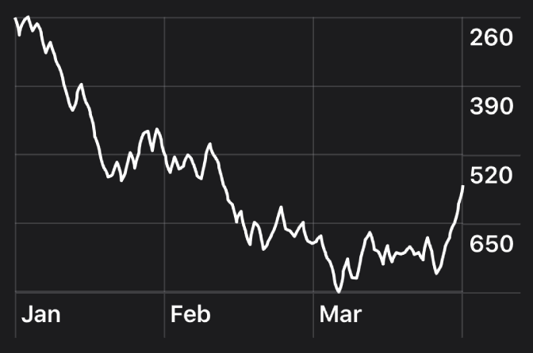
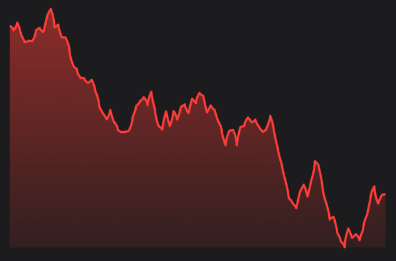

# SwiftUILineChart



```swift
LineChartView(values: [1.1, 2.3, 5.5 ... 3.8], horizontalTicks: ["A", "B", "C"],
verticalTicks: ["1", "2", "3"], style: LineChartStyle())

```


```swift
LineChartView(values: [1.1, 2.3, 5.5 ... 3.8], horizontalTicks: ["A", "B", "C"],
verticalTicks: ["1", "2", "3"], style: LineChartStyle.redOutline)
```
