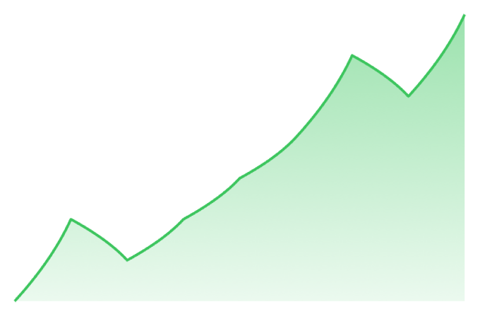
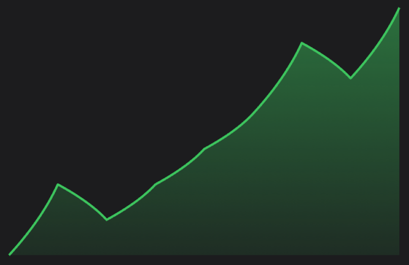

# SwiftUILineChart

Library was developed to represent line graphs like in Apple Stocks app, but also contains some customization

## Installation

`XCode -> File -> Swift Packages -> Add Package Dependency`   
Then add `https://github.com/DuckSowl/SwiftUILineChart` as package repository

## Usage

Import library by  `import SwiftUILineChart` statement and add `LineChartView(...)` to your parent view

It was originally developed for dark theme


```swift
LineChartView(data: [10, 13, 12, 8, 11, 12, 15, 17, 12, 14, 12, 13, 10])
```

To use with light theme


```swift
LineChartView(data: [10, 13, 12, 8, 11, 12, 15, 17, 12, 14, 12, 13, 10],
              style: .light)
```

Red style

  

```swift
LineChartView(data: [10, 13, 12, 8, 11, 12, 15, 17, 12, 14, 12, 13, 10],
              style: .red)
```

Green style

  

```swift
LineChartView(data: [10, 13, 12, 8, 11, 12, 15, 17, 12, 14, 12, 13, 10],
              style: .green)
```
Optionaly ticks


```swift
LineChartView(data: [10, 14, 12, 16, 12, 13, 9, 11, 8],
              horizontalTicks: ["Feb", "Mar", "Apr"],
              verticalTicks: ["10", "12", "14", "16"])
```


```swift
LineChartView(data: [16, 14, 15, 13, 12, 13, 9, 11, 8],
              horizontalTicks: ["Feb", "Mar", "Apr"],
              verticalTicks: ["10", "12", "14", "16"],
              style: .red)
```

### Styling with `LineChartStyle`


```swift
LineChartView(data: data,
              horizontalTicks: horizontalTicks,
              verticalTicks: verticalTicks,
              style: LineChartStyle(drawTicks: true,
                                    drawGrid: true,
                                    gridColor: .orange,
                                    lineColor: .green,
                                    gradient: Gradient(colors: [
                                        .yellow, .pink, .blue, .clear
                                    ])))
```
